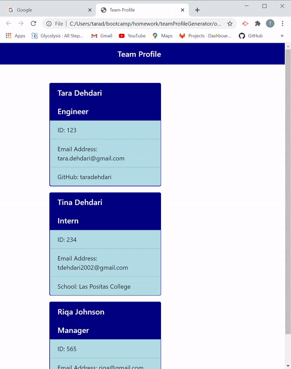

# Team Profile

Team Profile Generator, for creating your work team!

## Instructions

First you have to do an  npm install to get all the dependencies.

When you run node app.js in the terminal, you will be prompted to answer the questions to build your team

   ### Picture of prompts
  

  between each member it asks wether you want to add more employees. When youve added everyone, it will create a team.html file in the output folder

  ### Gif of team.html output
  

    

